# HireIQ — Complete Technical Architecture & Documentation

> **Version:** 1.0 · **Platform:** Enterprise AI-Powered Recruitment  
> **Stack:** Spring Boot 3 · React 18 · PostgreSQL 16 · Claude AI · AWS

---

## Table of Contents

1. [Executive Overview](#1-executive-overview)
2. [System Architecture](#2-system-architecture)
3. [Technology Stack](#3-technology-stack)
4. [Database Design](#4-database-design)
5. [API Reference](#5-api-reference)
6. [Authentication & Security Flow](#6-authentication--security-flow)
7. [Candidate Pipeline State Machine](#7-candidate-pipeline-state-machine)
8. [Resume Analysis Pipeline](#8-resume-analysis-pipeline)
9. [AI Integration Architecture](#9-ai-integration-architecture)
10. [Frontend Architecture](#10-frontend-architecture)
11. [User Roles & Permissions](#11-user-roles--permissions)
12. [Feature Data Flows](#12-feature-data-flows)
13. [Infrastructure & Deployment](#13-infrastructure--deployment)
14. [Local Storage Schema](#14-local-storage-schema)
15. [Environment Configuration](#15-environment-configuration)
16. [CI/CD Pipeline](#16-cicd-pipeline)

---

## 1. Executive Overview

HireIQ is a **full-stack, multi-tenant, AI-powered enterprise Applicant Tracking System (ATS)**. It automates the entire hiring lifecycle — from job posting and public candidate application, through AI-assisted resume scoring and pipeline management, to interview scheduling, panel feedback collection, and offer management.

### Core Capabilities

| Capability | Description |
|---|---|
| **AI Resume Analysis** | Claude AI parses resumes and scores them 0–100 against job requirements |
| **Hiring Pipeline** | Kanban-style drag-and-drop candidate progression across configurable stages |
| **Interview Scheduling** | Calendar-based scheduling with Google/Outlook integration |
| **Panel Feedback** | Structured skill rating forms submitted by panel members per interview round |
| **Email Notifications** | AWS SES-triggered emails at every hiring action (shortlist, reject, invite, offer) |
| **AI Chat Assistant** | Live Claude AI chatbot with real-time DB context for recruiter queries |
| **Analytics Dashboard** | ATS score distributions, pipeline stats, job metrics, skill gap analysis |
| **Multi-Tenancy** | Every data entity is scoped to an `Organization` UUID |
| **Public Job Apply** | Branded candidate-facing apply page with instant AI analysis |
| **Candidate Sourcing** | External job board search via JSearch / RapidAPI |

### User Personas

```
┌─────────────────────────────────────────────────────────────────────┐
│  HR Administrator   →  Full platform access, configuration, reports  │
│  Recruiter          →  Candidate management, pipeline, scheduling     │
│  Hiring Manager     →  Pipeline review, offer decisions               │
│  Panel Member       →  My interviews, evaluation forms, calendar      │
│  Candidate          →  Public apply page only                         │
│  Super Admin        →  Cross-organization administration              │
└─────────────────────────────────────────────────────────────────────┘
```

---

## 2. System Architecture

### High-Level Architecture

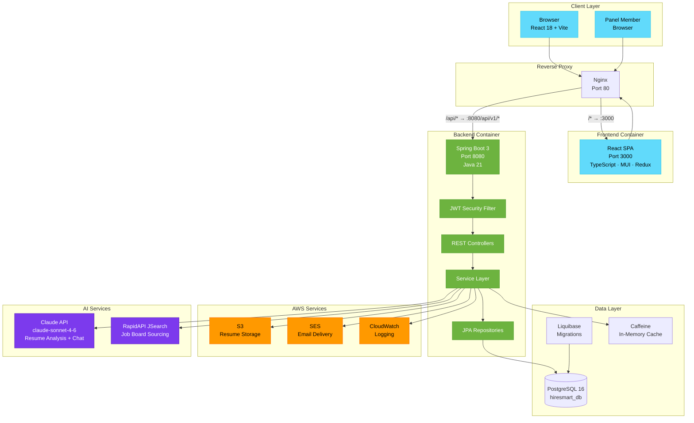

### Request Flow

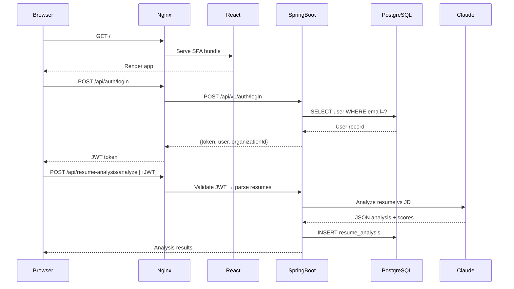

---

## 3. Technology Stack

### Backend

| Layer | Technology | Version | Purpose |
|---|---|---|---|
| Runtime | Java | 21 LTS | Application runtime |
| Framework | Spring Boot | 3.x | Web framework, DI, auto-config |
| Security | Spring Security + JWT | — | Authentication & authorization |
| ORM | Spring Data JPA / Hibernate | 6.x | Database abstraction |
| DB Migrations | Liquibase | — | Schema versioning |
| Connection Pool | HikariCP | — | PostgreSQL connection pooling |
| Cache | Caffeine | — | In-memory L1 cache |
| Storage | AWS SDK v2 S3 | — | Resume file storage |
| Email | AWS SES Java Client | — | Transactional emails |
| NLP | Apache PDFBox + Apache POI | — | Resume text extraction |
| AI | Anthropic Claude API | claude-sonnet-4-6 | Resume analysis + chat |
| Monitoring | Spring Actuator + Micrometer | — | Health, metrics, Prometheus |
| API Docs | SpringDoc OpenAPI | — | Swagger UI |
| Build | Maven | 3.9 | Dependency management & build |

### Frontend

| Layer | Technology | Version | Purpose |
|---|---|---|---|
| Framework | React | 18 | UI component framework |
| Language | TypeScript | 5.x | Type safety |
| Build Tool | Vite | 5.x | Dev server & production bundler |
| UI Library | MUI (Material-UI) | 5.x | Component library |
| State | Redux Toolkit | 2.x | Global state management |
| Routing | React Router DOM | 6.x | Client-side routing |
| HTTP | Axios | — | API client with interceptors |
| Markdown | react-markdown | — | AI chat response rendering |

### Infrastructure

| Component | Technology | Purpose |
|---|---|---|
| Database | PostgreSQL 16 | Primary data store |
| Reverse Proxy | Nginx | TLS termination, routing, static files |
| Containerization | Docker + Docker Compose | Local & production deployment |
| CI/CD | GitHub Actions | Automated testing & deployment |
| Registry | GitHub Container Registry (GHCR) | Docker image storage |
| Secrets | Environment variables via `.env.docker` | Configuration injection |

---

## 4. Database Design

### Entity-Relationship Overview

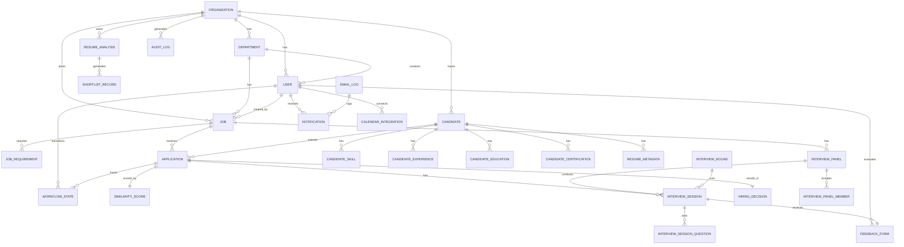

### Core Tables

#### `organizations`
| Column | Type | Constraints | Description |
|---|---|---|---|
| `id` | UUID | PK | Auto-generated |
| `name` | VARCHAR(255) | NOT NULL | Company name |
| `email` | VARCHAR(255) | UNIQUE | Primary contact |
| `phone` | VARCHAR(50) | — | Phone number |
| `industry` | VARCHAR(100) | — | Industry vertical |
| `company_size` | VARCHAR(50) | — | Employee range |
| `created_at` | TIMESTAMP | DEFAULT NOW() | Record creation |

#### `users`
| Column | Type | Constraints | Description |
|---|---|---|---|
| `id` | UUID | PK | Auto-generated |
| `org_id` | UUID | FK → organizations | Tenant scope |
| `department_id` | UUID | FK → departments | Optional dept |
| `email` | VARCHAR(255) | UNIQUE(org_id, email) | Login email |
| `password_hash` | VARCHAR(255) | NOT NULL | BCrypt hash |
| `first_name` | VARCHAR(100) | NOT NULL | First name |
| `last_name` | VARCHAR(100) | NOT NULL | Last name |
| `role` | VARCHAR(50) | ENUM | HR_ADMINISTRATOR, RECRUITER, etc. |
| `is_active` | BOOLEAN | DEFAULT TRUE | Account status |
| `last_login_at` | TIMESTAMP | — | Last login |

#### `jobs`
| Column | Type | Constraints | Description |
|---|---|---|---|
| `id` | UUID | PK | — |
| `org_id` | UUID | FK → organizations | Tenant |
| `department_id` | UUID | FK → departments | Owning dept |
| `created_by_user_id` | UUID | FK → users | Author |
| `title` | VARCHAR(255) | NOT NULL | Job title |
| `description` | TEXT | — | Full JD text |
| `employment_type` | VARCHAR(50) | ENUM | FULL_TIME, CONTRACT, etc. |
| `work_mode` | VARCHAR(50) | ENUM | REMOTE, HYBRID, ON_SITE |
| `status` | VARCHAR(50) | ENUM DEFAULT DRAFT | DRAFT/OPEN/CLOSED/FILLED |
| `job_code` | VARCHAR(50) | UNIQUE | Auto-generated code |
| `salary_min` | DECIMAL(12,2) | — | Min salary |
| `salary_max` | DECIMAL(12,2) | — | Max salary |
| `salary_currency` | VARCHAR(10) | DEFAULT USD | Currency code |
| `location` | VARCHAR(255) | — | Office location |
| `min_experience_years` | INTEGER | — | Min exp required |
| `max_experience_years` | INTEGER | — | Max exp preferred |
| `deadline` | DATE | — | Application deadline |
| `posted_date` | TIMESTAMP | — | When published |
| `created_at` | TIMESTAMP | DEFAULT NOW() | — |

#### `resume_analysis`
| Column | Type | Constraints | Description |
|---|---|---|---|
| `id` | VARCHAR(36) | PK | UUID string |
| `organization_id` | VARCHAR(36) | NOT NULL | Tenant scope |
| `job_id` | VARCHAR(36) | NOT NULL | Target job |
| `job_title` | VARCHAR(255) | — | Denormalized title |
| `candidate_name` | VARCHAR(255) | NOT NULL | — |
| `email` | VARCHAR(255) | — | Candidate email |
| `current_role` | VARCHAR(255) | — | Current job title |
| `phone` | VARCHAR(50) | — | — |
| `ats_score` | DOUBLE | — | 0–100 composite score |
| `matched_skills_json` | TEXT | JSON array | Matched skills |
| `missing_skills_json` | TEXT | JSON array | Missing skills |
| `years_of_experience` | INTEGER | — | Parsed YoE |
| `education` | TEXT | — | Highest education |
| `professional_summary` | TEXT | — | AI narrative |
| `resume_file_name` | VARCHAR(255) | — | Original filename |
| `resume_s3_url` | TEXT | — | S3 presigned URL |
| `rating` | VARCHAR(20) | ENUM | EXCELLENT/GOOD/FAIR/POOR |
| `hiring_recommendation` | VARCHAR(20) | — | STRONG_FIT to NOT_FIT |
| `full_analysis_json` | TEXT | JSON | Complete Claude analysis |
| `score_breakdown_json` | TEXT | JSON | Component scores |
| `key_strengths_json` | TEXT | JSON array | Top strengths |
| `areas_for_improvement_json` | TEXT | JSON array | Gaps |
| `jd_alignment` | TEXT | — | JD match narrative |
| `is_applied` | BOOLEAN | DEFAULT FALSE | Pipeline flag |
| `source` | VARCHAR(50) | — | HR_ANALYZED / PUBLIC_APPLY |
| `analyzed_at` | TIMESTAMP | — | Analysis timestamp |
| `created_at` | TIMESTAMP | DEFAULT NOW() | — |

#### `applications`
| Column | Type | Constraints | Description |
|---|---|---|---|
| `id` | UUID | PK | — |
| `org_id` | UUID | FK → organizations | Tenant |
| `candidate_id` | UUID | FK → candidates | Applicant |
| `job_id` | UUID | FK → jobs | Target job |
| `status` | VARCHAR(50) | ENUM | Pipeline stage |
| `similarity_score` | DECIMAL(5,2) | — | 0–100 match |
| `ai_recommendation` | TEXT | — | Claude narrative |
| `recruiter_notes` | TEXT | — | Internal notes |
| `is_shortlisted` | BOOLEAN | DEFAULT FALSE | — |
| `rejection_reason` | TEXT | — | If rejected |
| `applied_date` | TIMESTAMP | NOT NULL | When applied |

#### `interview_sessions`
| Column | Type | Constraints | Description |
|---|---|---|---|
| `id` | UUID | PK | — |
| `org_id` | UUID | FK | Tenant |
| `application_id` | UUID | FK → applications | — |
| `panel_id` | UUID | FK → interview_panels | — |
| `round_id` | UUID | FK → interview_rounds | — |
| `scheduled_at` | TIMESTAMP | NOT NULL | Scheduled start |
| `status` | VARCHAR(50) | ENUM | SCHEDULED/COMPLETED/etc |
| `meeting_link` | VARCHAR(500) | — | Video call URL |
| `meeting_notes` | TEXT | — | Session notes |

#### `feedback_forms`
| Column | Type | Constraints | Description |
|---|---|---|---|
| `id` | UUID | PK | — |
| `interview_session_id` | UUID | OneToOne FK | — |
| `evaluator_user_id` | UUID | FK → users | Panel member |
| `overall_rating` | VARCHAR(30) | ENUM | STRONG_HIRE to STRONG_NO_HIRE |
| `technical_rating` | DECIMAL(3,1) | — | 0.0 – 5.0 |
| `communication_rating` | DECIMAL(3,1) | — | 0.0 – 5.0 |
| `cultural_fit_rating` | DECIMAL(3,1) | — | 0.0 – 5.0 |
| `problem_solving_rating` | DECIMAL(3,1) | — | 0.0 – 5.0 |
| `feedback_notes` | TEXT | — | Free-text notes |
| `recommendation` | VARCHAR(50) | — | Final decision |
| `submitted_at` | TIMESTAMP | — | — |

#### `email_logs`
| Column | Type | Constraints | Description |
|---|---|---|---|
| `id` | UUID | PK | — |
| `recipient_email` | VARCHAR(255) | NOT NULL | To address |
| `notification_type` | VARCHAR(50) | ENUM | SHORTLIST / REJECTION / etc |
| `subject` | VARCHAR(500) | NOT NULL | Email subject |
| `body` | TEXT | NOT NULL | HTML body |
| `sent_at` | TIMESTAMP | NOT NULL | Send time |
| `delivery_status` | VARCHAR(20) | ENUM | SENT/FAILED/BOUNCED |
| `delivery_error_message` | TEXT | — | Error detail |
| `related_entity_id` | UUID | — | Source record ID |

### Database Schema Migration Strategy

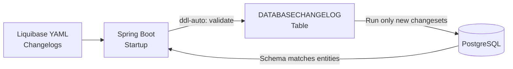

Liquibase master file: `resources/db/changelog/db.changelog-master.yaml`  
Mode: `validate` in production (migrations only via Liquibase, never via Hibernate DDL)

---

## 5. API Reference

All routes prefixed `/api/v1`. JWT Bearer token required unless marked **[PUBLIC]**.

### Authentication (`/api/v1/auth`)

| Method | Path | Body | Response | Notes |
|---|---|---|---|---|
| `POST` | `/login` | `{email, password}` | `{token, refreshToken, user, organizationId}` | Issues JWT |
| `POST` | `/register` | `{firstName, lastName, email, password}` | `{token, user}` | Creates org + user |
| `POST` | `/logout` | — | `{success}` | Clears server session |

### Jobs (`/api/v1/organizations/{orgId}/jobs`)

| Method | Path | Query Params | Response |
|---|---|---|---|
| `GET` | `/` | `page, size, sortBy, direction, search` | `PageableResponseDTO<Job>` |
| `GET` | `/{jobId}` | — | `Job` |
| `GET` | `/by-status` | `status, page, size` | `PageableResponseDTO<Job>` |
| `GET` | `/open` | — | `List<Job>` |
| `GET` | `/search` | `query, page, size` | `PageableResponseDTO<Job>` |
| `POST` | `/` | `JobDTO` | `Job` |
| `PUT` | `/{jobId}` | `JobDTO` | `Job` |
| `PUT` | `/{jobId}/publish` | — | `Job` (status → OPEN) |
| `PUT` | `/{jobId}/close` | — | `Job` (status → CLOSED) |
| `DELETE` | `/{jobId}` | — | `204 No Content` |

### Candidates (`/api/v1/organizations/{orgId}/candidates`)

| Method | Path | Query Params | Response |
|---|---|---|---|
| `GET` | `/` | `page, size, sortBy, direction` | `PageableResponseDTO<Candidate>` |
| `GET` | `/{candidateId}` | — | `Candidate` |
| `GET` | `/search` | `query, page, size` | `PageableResponseDTO<Candidate>` |
| `GET` | `/by-skill` | `skill, page, size` | Filtered list |
| `GET` | `/by-experience` | `minYears, maxYears, page, size` | Filtered list |
| `POST` | `/` | `CandidateDTO` | `Candidate` |
| `PUT` | `/{candidateId}` | `CandidateDTO` | `Candidate` |
| `DELETE` | `/{candidateId}` | — | `204` |

### Resume Analysis (`/api/v1/resume-analysis`)

| Method | Path | Body / Params | Notes |
|---|---|---|---|
| `POST` | `/analyze` | Multipart: `organizationId, jobId, jobTitle, jobDescription, minExperience, maxExperience, requiredSkills, files[]` | AI analysis via Claude, stores results |
| `GET` | `/org` | `organizationId, q, page, size` | Search all analyses |
| `GET` | `/{id}` | `organizationId` | Single analysis |
| `GET` | `/job/{jobId}` | `organizationId, page, size` | Job-scoped analyses |
| `GET` | `/job/{jobId}/top` | `organizationId, limit=10` | Highest ATS scores |
| `GET` | `/job/{jobId}/applied` | — | Candidates added to pipeline |
| `GET` | `/org/{orgId}/applied` | — | All pipeline candidates |
| `GET` | `/{id}/download` | `organizationId` | S3 presigned URL |
| `PUT` | `/{id}` | Partial update body | Update analysis record |
| `DELETE` | `/{id}` | `organizationId` | Remove record |
| `PATCH` | `/bulk-import` | `{ids: []}` | Mark batch as imported |

### Notifications (`/api/v1/notifications`)

| Method | Path | Body |
|---|---|---|
| `POST` | `/shortlist` | `{email, name, jobTitle}` |
| `POST` | `/reject` | `{email, name, jobTitle}` |
| `POST` | `/interview` | `{email, name, jobTitle, dateTime, mode, meetingLink}` |
| `POST` | `/offer` | `{email, name, jobTitle}` |
| `GET` | `/logs` | — |

### Analytics (`/api/v1/analytics`)

| Method | Path | Params | Response Shape |
|---|---|---|---|
| `GET` | `/dashboard` | `organizationId` | `{totalProfiles, totalApplied, openJobs, avgAtsScore, atsDistribution{}, applicationsByJob[], jobStatusDistribution{}, sourceBreakdown{}, experienceDistribution{}, ratingBreakdown{}, topSkills[]}` |

### AI Services (`/api/v1/ai`)

| Method | Path | Body | Response |
|---|---|---|---|
| `POST` | `/chat` | `{question, organizationId, history[]}` | `{answer, enabled}` |
| `GET` | `/status` | — | `{enabled: bool}` |

### Sourcing (`/api/v1/sourcing`)

| Method | Path | Body | Response |
|---|---|---|---|
| `POST` | `/search` | `{jobTitle, keywords, location?, remoteOnly?}` | `{results[], query, apiKeyMissing}` |

### Public [PUBLIC] (`/api/v1/public`)

| Method | Path | Notes |
|---|---|---|
| `GET` | `/jobs/{jobId}` | Job card for apply page — no auth required |
| `POST` | `/jobs/{jobId}/apply` | Multipart: `name, email, phone, resume` → instant AI analysis |

### Standard Response Envelope

```json
{
  "success": true,
  "message": "OK",
  "data": { ... },
  "timestamp": "2026-06-24T10:00:00Z",
  "errors": null
}
```

Pagination wrapper: `PageableResponseDTO<T>`

```json
{
  "content": [],
  "totalElements": 150,
  "totalPages": 6,
  "currentPage": 0,
  "pageSize": 25
}
```

---

## 6. Authentication & Security Flow

### JWT Authentication Sequence

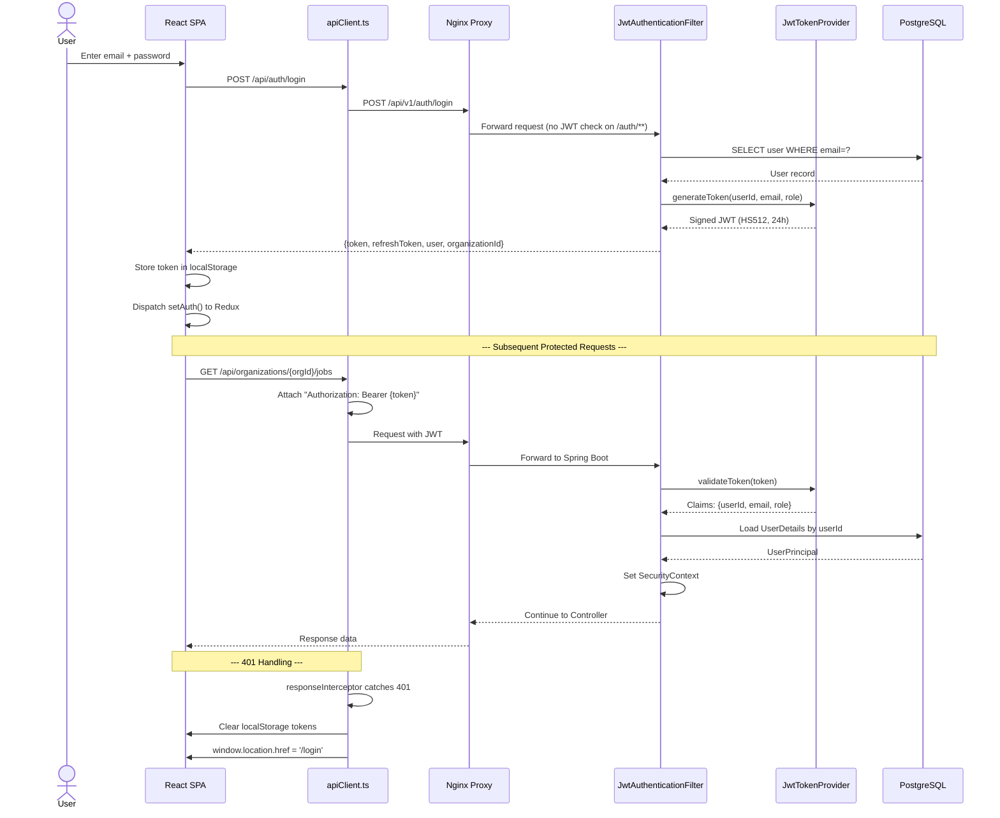

### Security Filter Chain

```mermaid
flowchart TD
    REQ[Incoming Request] --> CORS[CORS Filter<br/>Allow: localhost:3000/5173]
    CORS --> PUBLIC{Public<br/>endpoint?}
    PUBLIC -->|"/auth/** /public/** /health/**"| PASS[Pass through]
    PUBLIC -->|Other| JWT[Extract Bearer Token<br/>from Authorization header]
    JWT --> VALID{Token<br/>valid?}
    VALID -->|No / Missing| R401[Return 401<br/>Unauthorized]
    VALID -->|Yes| LOAD[Load UserPrincipal<br/>from PostgreSQL]
    LOAD --> ACTIVE{User<br/>active?}
    ACTIVE -->|No| R401
    ACTIVE -->|Yes| CTX[Set SecurityContext<br/>UserPrincipal]
    CTX --> CTRL[Route to Controller]
    CTRL --> AUTH{@PreAuthorize<br/>check}
    AUTH -->|Denied| R403[Return 403<br/>Forbidden]
    AUTH -->|Passed| HANDLE[Handle Request]
```

### JWT Token Structure

```
Header: { "alg": "HS512", "typ": "JWT" }
Payload: {
  "sub": "user-uuid",
  "email": "hr@company.com",
  "role": "HR_ADMINISTRATOR",
  "iat": 1719216000,
  "exp": 1719302400   ← 24 hours
}
Signature: HMACSHA512(base64(header) + "." + base64(payload), JWT_SECRET)
```

---

## 7. Candidate Pipeline State Machine

### CandidateStatus Transitions

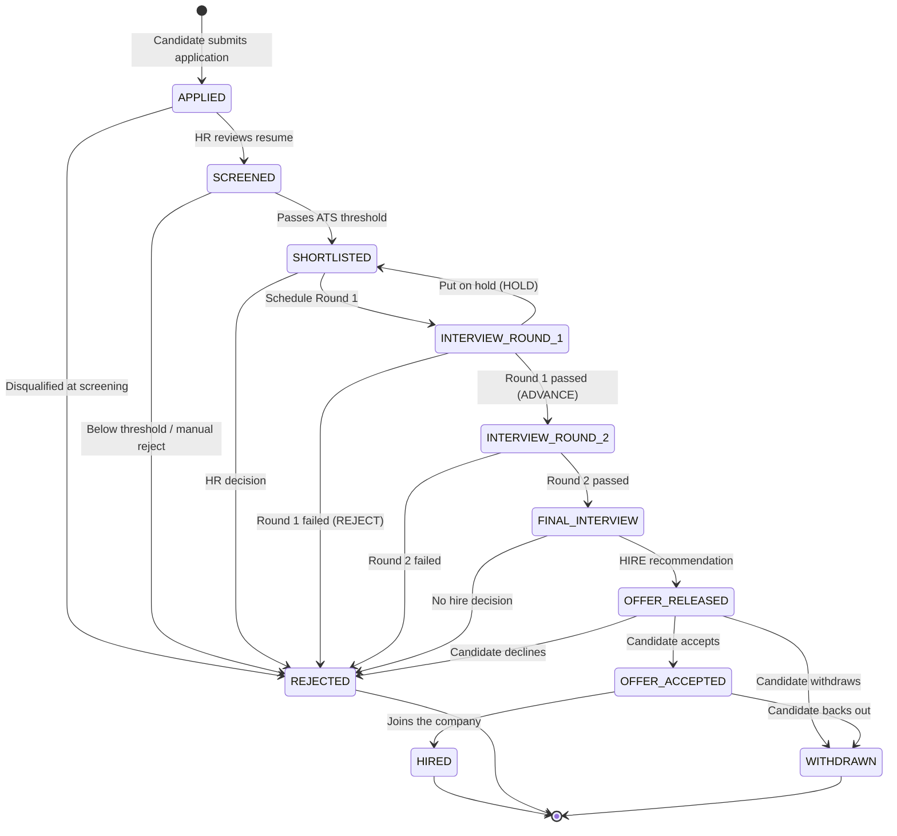

### Pipeline Kanban Flow (HireIQ Custom Stages)

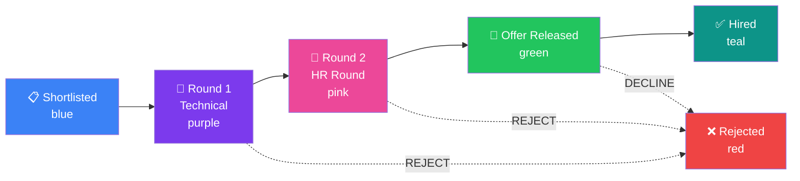

### Workflow State Tracking

Every status transition is recorded in `workflow_states`:

```
application_id | from_status      | to_status         | transitioned_by | reason        | at
──────────────────────────────────────────────────────────────────────────────────────────────
uuid-001       | APPLIED          | SCREENED          | hr-user-uuid    | Auto-screened | ...
uuid-001       | SCREENED         | SHORTLISTED       | hr-user-uuid    | ATS ≥ 70      | ...
uuid-001       | SHORTLISTED      | INTERVIEW_ROUND_1 | hr-user-uuid    | Scheduled     | ...
uuid-001       | INTERVIEW_ROUND_1| OFFER_RELEASED    | hr-user-uuid    | HIRE rec.     | ...
```

---

## 8. Resume Analysis Pipeline

### End-to-End Resume Processing Flow

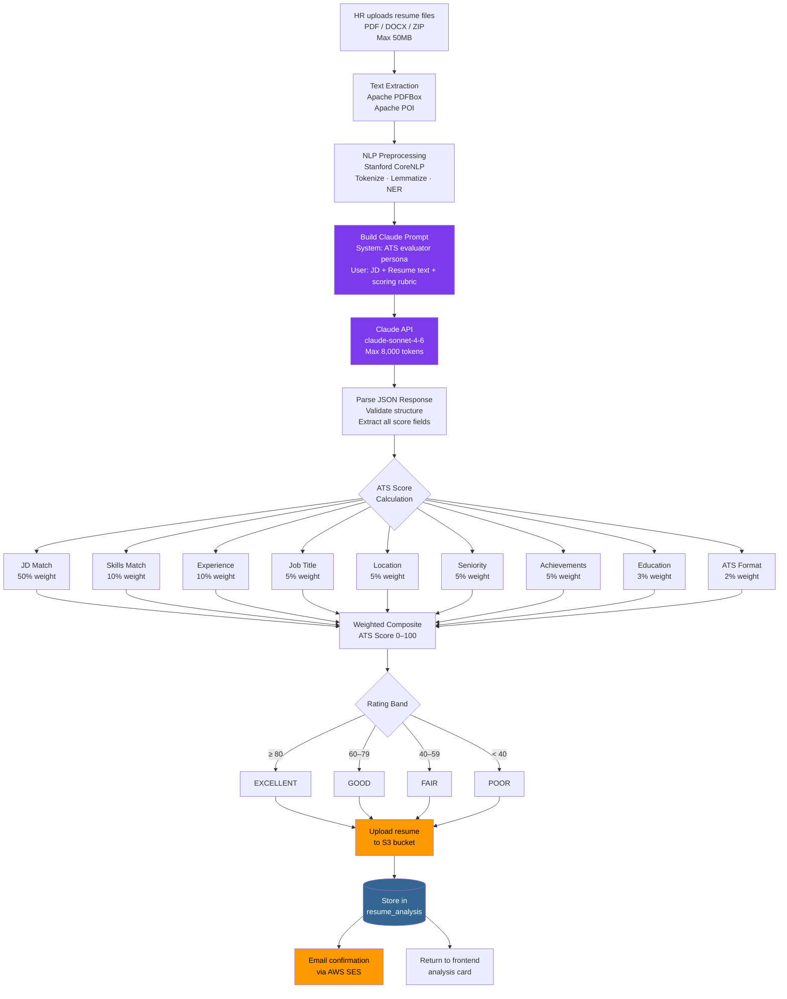

### Full Analysis JSON Structure (stored in `full_analysis_json`)

```json
{
  "overall_score": 72,
  "recommendation": "Strong Interview",
  "interview_probability": {
    "percentage": 65,
    "assessment": "High — strong technical match with minor gaps"
  },
  "recruiter_summary": "...",
  "hiring_manager_summary": "...",
  "job_description_match": {
    "score": 68,
    "matched_responsibilities": ["..."],
    "missing_responsibilities": ["..."],
    "matched_qualifications": ["..."],
    "missing_qualifications": ["..."]
  },
  "required_skills_match": {
    "score": 75,
    "required_skills_count": 12,
    "matched_skills_count": 9,
    "matched_skills": ["React", "TypeScript"],
    "partially_matched_skills": ["Node.js"],
    "missing_skills": ["GraphQL"],
    "skill_evidence": [
      { "skill": "React", "evidence_level": 3, "evidence": "5 years in prod" }
    ]
  },
  "experience_match":        { "score": 80, "required_years": 5, "candidate_years": 7 },
  "job_title_match":         { "score": 70, "candidate_title": "Senior Dev", "target_title": "Lead Engineer" },
  "location_match":          { "score": 0,  "candidate_location": "Unknown", "job_location": "San Francisco" },
  "seniority_match":         { "score": 85, "candidate_level": "Senior", "required_level": "Senior" },
  "achievement_impact":      { "score": 60, "achievements": ["..."] },
  "education_certifications":{ "score": 90 },
  "ats_readability":         { "score": 75 },
  "top_strengths":           ["..."],
  "high_priority_gaps":      ["..."],
  "critical_missing_requirements": ["..."],
  "improvement_recommendations":   ["..."]
}
```

### Public Apply Flow

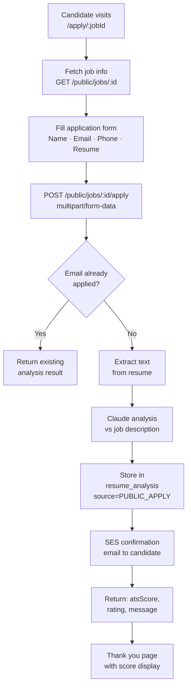

---

## 9. AI Integration Architecture

### Claude AI Usage Points

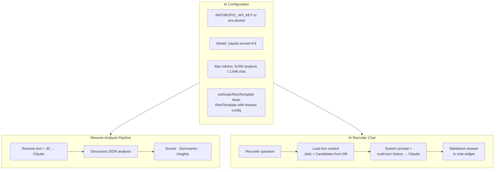

### AI Chat Context Assembly

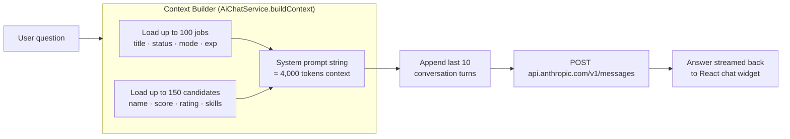

### Resume Analysis Prompt Strategy

The system prompt instructs Claude to act as a **senior ATS evaluator**, providing:
1. Weighted component scores (JD match 50%, Skills 10%, Experience 10%, etc.)
2. Structured JSON output with evidence for each skill
3. Recruiter-facing and hiring-manager-facing narrative summaries
4. Interview probability assessment
5. Strengths, gaps, and improvement recommendations

---

## 10. Frontend Architecture

### Component Hierarchy

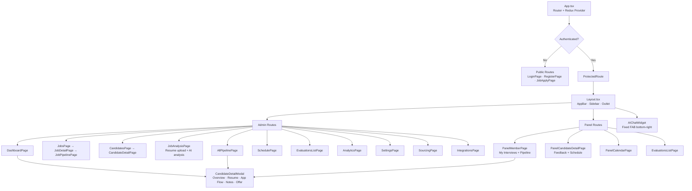

### Redux Store Architecture

```mermaid
flowchart LR
    subgraph STORE["Redux Store"]
        AUTH[authSlice<br/>isAuthenticated<br/>user · token · organizationId]
        JOBS_S[jobsSlice<br/>jobs[] · selectedJob<br/>pagination · loading]
        CANDS_S[candidatesSlice<br/>candidates[] · selectedCandidate<br/>pagination · loading]
    end

    subgraph THUNKS["Async Thunks"]
        T1[login · register<br/>loginAsPanelMember · logout]
        T2[fetchJobs · getJobById<br/>createJob · updateJob<br/>publishJob · deleteJob]
        T3[fetchCandidates · searchCandidates<br/>getCandidateById · createCandidate]
    end

    subgraph API["API Layer"]
        AX[apiClient.ts<br/>Axios instance<br/>baseURL: VITE_API_URL<br/>Request: attach Bearer token<br/>Response: 401 → redirect /login]
    end

    T1 --> AUTH
    T2 --> JOBS_S
    T3 --> CANDS_S
    T1 & T2 & T3 --> AX
    AX -->|"HTTP"| BACKEND[Spring Boot API]
```

### Data Flow: Admin Opens Candidate Modal

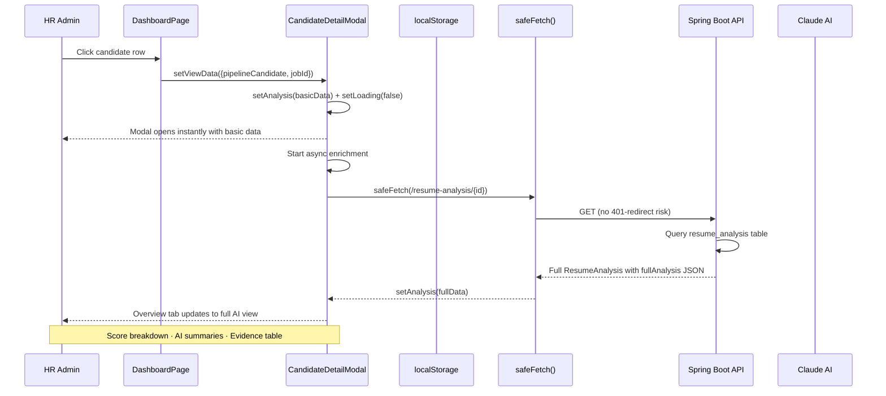

### Vite Proxy Configuration (Development)

```
/api/*  →  http://localhost:8080/api/v1/*
          (strips /api prefix, prepends /api/v1)
```

Production: `VITE_API_URL=http://localhost/api/v1` (Docker via nginx)

---

## 11. User Roles & Permissions

### Role Hierarchy

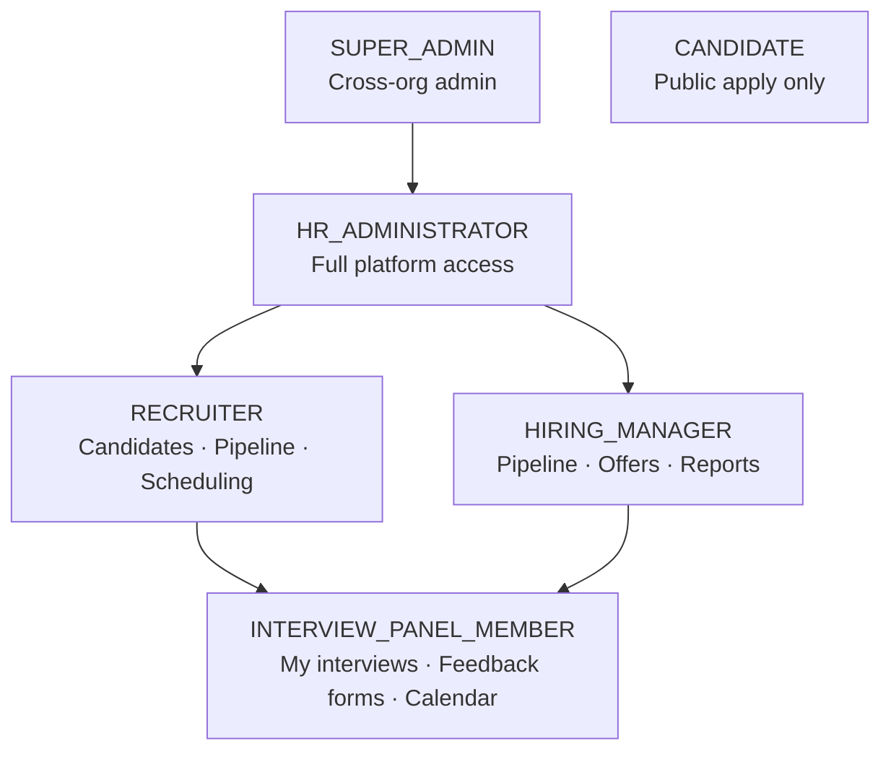

### Permission Matrix

| Feature | Super Admin | HR Admin | Recruiter | Hiring Manager | Panel Member |
|---|:---:|:---:|:---:|:---:|:---:|
| Create / Edit Jobs | ✅ | ✅ | ✅ | ✅ | ❌ |
| Publish / Close Jobs | ✅ | ✅ | ✅ | ✅ | ❌ |
| Resume Analysis | ✅ | ✅ | ✅ | ✅ | ❌ |
| Pipeline Management | ✅ | ✅ | ✅ | ✅ | view |
| Candidate Detail Modal | ✅ | ✅ | ✅ | ✅ | ✅ |
| Interview Scheduling | ✅ | ✅ | ✅ | ✅ | ✅ |
| Submit Feedback | ✅ | ✅ | — | ✅ | ✅ |
| View Evaluations | ✅ | ✅ | ✅ | ✅ | own only |
| Send Emails | ✅ | ✅ | ✅ | ✅ | ❌ |
| Analytics Dashboard | ✅ | ✅ | ✅ | ✅ | ❌ |
| Offer Management | ✅ | ✅ | ❌ | ✅ | ❌ |
| Settings | ✅ | ✅ | ✅ | ✅ | ❌ |
| Sourcing | ✅ | ✅ | ✅ | ❌ | ❌ |
| AI Chat | ✅ | ✅ | ✅ | ✅ | ❌ |

### Panel Member Auth Flow (Local Auth)

Panel members are stored in **localStorage**, not the backend database, to support offline demo functionality:

```mermaid
flowchart TD
    PM[Panel member clicks login] --> CHECK{Admin JWT<br/>in localStorage?}
    CHECK -->|Yes – token not synthetic| USE[Reuse admin token<br/>+ admin org UUID]
    CHECK -->|No| SYNTH[Generate synthetic token<br/>panel_{id}_{timestamp}]
    USE --> SET[Set Redux auth state<br/>role: PANEL_MEMBER]
    SYNTH --> SET
    SET --> REDIRECT[Navigate to /panel]
    REDIRECT --> FETCH[fetchJobs dispatch<br/>GET /organizations/{orgId}/jobs]
    FETCH --> PIPE[Build pipeline from localStorage<br/>pipeline_{jobId} keys]
```

**Why local auth?** Panel members are HR-configured personas within the organization. They log in via a separate panel embedded in the admin UI, not through the main backend auth endpoint.

---

## 12. Feature Data Flows

### Email Notification Flow

```mermaid
flowchart TD
    ACTION[HR Action<br/>shortlist · reject · schedule · offer] --> CHECK[Check HsSettings<br/>emailOn{Action} = true?]
    CHECK -->|Disabled| SKIP[Skip email]
    CHECK -->|Enabled| CALL[POST /api/v1/notifications/{action}<br/>{email, name, jobTitle}]
    CALL --> SVC[EmailService.java<br/>Build HTML template]
    SVC --> SES[AWS SES<br/>SendEmailRequest]
    SES --> INBOX[Candidate inbox]
    SES --> LOG[EmailLog record<br/>status: SENT or FAILED]
    SES -->|SesException| CATCH[Log error<br/>Never throws — HR action continues]
    CATCH --> LOG
```

Email template types:
- **Shortlist** — "Congratulations! You've been shortlisted for {jobTitle}"
- **Rejection** — "Thank you for applying to {jobTitle}…"
- **Interview** — Invitation with date, time, format, and meeting link
- **Offer** — Offer letter notification

### Interview Scheduling Flow

```mermaid
flowchart TD
    HR[HR opens SchedulePage] --> SEL[Select candidate + job]
    SEL --> ROUND[Assign interview round<br/>TECHNICAL · HR · BEHAVIORAL · DESIGN · LEADERSHIP]
    ROUND --> PANEL[Assign panel members<br/>from seeded PanelMember list]
    PANEL --> DATE[Pick date/time + format<br/>VIDEO · IN_PERSON · PHONE]
    DATE --> SAVE[saveSchedule() → localStorage<br/>saveInterviewRound() → localStorage]
    SAVE --> EMAIL[Send interview invitation email<br/>POST /notifications/interview]
    SAVE --> CAL[Optional: Push to Google/Outlook Calendar<br/>via CalendarIntegration tokens]
    SAVE --> PANEL_VIEW[Panel member sees in<br/>PanelMemberPage → My Interviews tab]
```

### Analytics Dashboard Data Flow

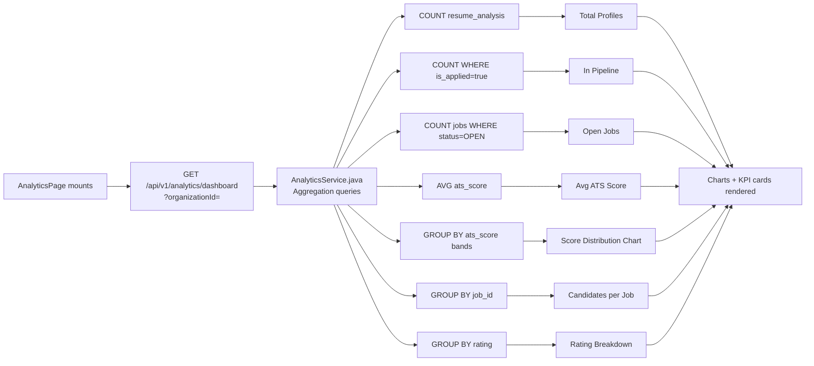

### Candidate Sourcing Flow

```mermaid
flowchart TD
    RECRUITER[Recruiter enters search<br/>job title + optional location]
    RECRUITER --> POST[POST /api/v1/sourcing/search]
    POST --> CHECK{RAPIDAPI_KEY<br/>configured?}
    CHECK -->|No| EMPTY[Return empty list<br/>+ apiKeyMissing: true banner]
    CHECK -->|Yes| RAPID[GET jsearch.p.rapidapi.com/search<br/>"React Developer San Francisco"<br/>page=1&num_pages=2]
    RAPID --> MAP[Map to SourcingResultDTO<br/>title · company · location · link · skills]
    MAP --> INFER[Infer skills from job description<br/>keyword matching vs NLP skill list]
    INFER --> RESULT[Job listing cards in UI]
    RESULT --> ADD[Recruiter clicks "Add as Candidate"<br/>Pre-fill quick form]
    ADD --> PIPE[Save to pipeline<br/>source: 'sourced']
```

---

## 13. Infrastructure & Deployment

### Docker Services Architecture

```mermaid
flowchart TD
    subgraph DOCKER["Docker Compose Network: hiresmart-network"]
        subgraph PERSIST["Volumes"]
            PG_VOL[(postgres_data<br/>local volume)]
        end

        PG[postgres:16-alpine<br/>Container: hiresmart-db<br/>Port: 5432<br/>DB: hiresmart_db<br/>User: hiresmart_user]

        API[Spring Boot JAR<br/>Container: hiresmart-api<br/>Port: 8080<br/>ENV from .env.docker<br/>DDL: create on start]

        FE[React Static Build<br/>Container: smarthire-frontend<br/>Port: 3000<br/>VITE_API_URL=http://localhost/api/v1]

        NGX[Nginx:alpine<br/>Container: hiresmart-proxy<br/>Port: 80 → 443<br/>nginx.conf]

        PG_VOL --> PG
        PG -->|"Healthcheck: pg_isready<br/>depends_on: healthy"| API
        API -->|"Healthcheck: GET /health/status<br/>depends_on: healthy"| NGX
        FE --> NGX
    end

    BROWSER[Browser] --> NGX

    NGX -->|"location /api/ → proxy_pass :8080/api/v1/"| API
    NGX -->|"location / → proxy_pass :3000"| FE
```

### Nginx Routing Rules

```
GET  /           → React SPA (port 3000)
GET  /panel      → React SPA (client-side route)
POST /api/*      → Spring Boot (port 8080, rewrite: /api/ → /api/v1/)
GET  /swagger-ui → Pass through to Spring Boot
```

### CI/CD Pipeline (GitHub Actions)

```mermaid
flowchart TD
    PUSH[git push to main/develop] --> CI[GitHub Actions Trigger]

    CI --> B1[Job 1: Backend Tests<br/>mvn clean verify<br/>PostgreSQL service container]
    CI --> B2[Job 2: Frontend CI<br/>npm run lint<br/>npm run test<br/>npm run build]

    B1 & B2 --> SEC[Job 3: Security Scan<br/>Trivy vulnerability scanner<br/>Docker images + dependencies]

    SEC --> MAIN{Branch = main?}

    MAIN -->|No| DONE_DEV[Artifacts pass — PR can merge]

    MAIN -->|Yes| DOCK[Job 4: Docker Build + Push<br/>Build backend + frontend images<br/>Push to GHCR]

    DOCK --> STAG[Job 5: Deploy Staging<br/>docker-compose pull<br/>docker-compose up -d<br/>Health check: GET /health/status]

    STAG --> APPROV[Manual Approval Gate<br/>GitHub Environment: production]

    APPROV --> PROD[Job 6: Deploy Production<br/>Blue-Green via docker-compose]
```

### Smoke Test Endpoint

```
GET /api/v1/health/status

Response: { "status": "UP", "service": "HireIQ API", "timestamp": "..." }
```

---

## 14. Local Storage Schema

The frontend uses `localStorage` for all pipeline-specific state that doesn't need to persist to the backend. This enables offline-first functionality and fast iteration without backend migrations.

### Storage Keys

| Key Pattern | Type | Contents |
|---|---|---|
| `token` | String | JWT access token |
| `refreshToken` | String | JWT refresh token |
| `organizationId` | String | UUID of current org |
| `user` | JSON | User object (id, email, role, firstName, lastName) |
| `pipeline_{jobId}` | JSON | `PipelineState` for each job |
| `hs_schedules` | JSON | `InterviewSchedule[]` all interview schedules |
| `hs_evaluations` | JSON | `Evaluation[]` all feedback submissions |
| `hs_interview_rounds` | JSON | `InterviewRound[]` all round configs |
| `hs_shortlist_records` | JSON | `ShortlistRecord[]` shortlist audit trail |
| `hs_candidate_notes` | JSON | `CandidateNote[]` HR notes per candidate |
| `hs_panel_members` | JSON | `PanelMember[]` 20 seeded + custom members |
| `hs_panel_assignments` | JSON | `{[roundId]: PanelMember[]}` assignments |
| `hs_panel_accounts` | JSON | `PanelMemberAccount[]` login credentials |
| `hs_settings` | JSON | `HsSettings` ATS threshold, email toggles |
| `hs_job_board_config` | JSON | `JobBoardConfig` Dice/Monster/LinkedIn API keys |
| `hs_app_flow_events` | JSON | `AppFlowEvent[]` application timeline events |

### PipelineState Schema

```typescript
interface PipelineState {
  stages: PipelineStage[]          // Custom or DEFAULT_STAGES
  candidates: PipelineCandidate[]  // All candidates in this job's pipeline
  stageMap: {                      // candidateId → stageId
    [candidateId: string]: string
  }
  notes: {                         // candidateId → notes array
    [candidateId: string]: string[]
  }
  ratings: {                       // candidateId → star rating
    [candidateId: string]: number
  }
  hireDecisions: {                 // candidateId → final decision
    [candidateId: string]: HireDecision
  }
}
```

### Default Pipeline Stages

```
ID          LABEL                  TYPE       COLOR
─────────────────────────────────────────────────────
shortlisted  Interviewing          shortlist  #3B82F6
round_1      Round 1 – Technical   round      #7C3AED
round_2      Round 2 – HR          round      #EC4899
offer        Offer Released        offer      #22C55E
hired        Hired                 hired      #0D9488
rejected     Rejected              rejected   #EF4444
```

---

## 15. Environment Configuration

### `.env.docker` Variables

```bash
# ── Database ──────────────────────────────────────────────────────────
SPRING_DATASOURCE_URL=jdbc:postgresql://hiresmart-db:5432/hiresmart_db
SPRING_DATASOURCE_USERNAME=hiresmart_user
SPRING_DATASOURCE_PASSWORD=hiresmart_secure_password

# ── JWT ──────────────────────────────────────────────────────────────
JWT_SECRET=<256-bit secret>
JWT_EXPIRATION=86400000
JWT_REFRESH_EXPIRATION=604800000

# ── AWS ──────────────────────────────────────────────────────────────
AWS_ACCESS_KEY_ID=<from IAM>
AWS_SECRET_ACCESS_KEY=<from IAM>
AWS_REGION=us-east-1
AWS_S3_BUCKET=hiresmart-resumes
AWS_SES_EMAIL=noreply@hireiq.ai
AWS_SES_REGION=us-east-1

# ── AI ───────────────────────────────────────────────────────────────
ANTHROPIC_API_KEY=<claude api key>
ANTHROPIC_MODEL=claude-sonnet-4-6
ANTHROPIC_MAX_TOKENS=8000

# ── Optional ─────────────────────────────────────────────────────────
RAPIDAPI_KEY=<jsearch key>
```

### Key `application.properties` Settings

```properties
# Server
server.port=8080
spring.application.name=HireIQ

# Database  
spring.jpa.hibernate.ddl-auto=validate
spring.datasource.hikari.maximum-pool-size=20
spring.datasource.hikari.minimum-idle=5

# Cache
spring.cache.type=caffeine
spring.cache.caffeine.spec=maximumSize=10000,expireAfterWrite=10m

# File Upload
spring.servlet.multipart.max-file-size=50MB
spring.servlet.multipart.max-request-size=50MB

# Actuator
management.endpoints.web.exposure.include=health,metrics,prometheus
```

---

## 16. CI/CD Pipeline

### Branch Strategy

```
main        ─────●─────────────────●──── Production
                  \               /
develop     ───────●──●──●──●──●── Staging auto-deploy
                   feature/xyz
```

| Branch | Auto-deploy to | Approval required |
|---|---|---|
| `feature/*` | — | PR review |
| `develop` | Staging | — |
| `main` | Production | Yes (GitHub Environment) |

### Build Artifacts

| Stage | Output | Registry |
|---|---|---|
| Backend | `hiresmart-api:sha-{commit}` | `ghcr.io/org/hiresmart-api` |
| Frontend | `hiresmart-frontend:sha-{commit}` | `ghcr.io/org/hiresmart-frontend` |

### Test Commands

```bash
# Backend — unit + integration tests (requires Postgres)
mvn clean verify

# Backend — single test class
mvn test -Dtest=ResumeAnalysisServiceTest

# Frontend — lint + test + build
npm run lint && npm test -- --run && npm run build

# Coverage
mvn jacoco:report                   # Backend → target/site/jacoco/
npm run test:coverage               # Frontend → coverage/
```

---

## Appendix A — Demo Credentials

| Role | Email | Password |
|---|---|---|
| HR Administrator | `admin@hireiq.ai` | `Admin123!` |
| Panel Member | Sarah Chen | `sarah.chen@hiresmart.com` + any pw |
| Panel Member | Michael Torres | `michael.torres@hiresmart.com` + any pw |

---

## Appendix B — Key File Map

```
SmartHire/
├── backend/src/main/java/com/hiresmart/
│   ├── controller/          # REST endpoints
│   │   ├── AuthController.java
│   │   ├── JobController.java
│   │   ├── CandidateController.java
│   │   ├── ResumeAnalysisController.java
│   │   ├── PublicApplyController.java
│   │   ├── NotificationController.java
│   │   ├── AnalyticsController.java
│   │   ├── AiChatController.java
│   │   ├── SourcingController.java
│   │   ├── ShortlistController.java
│   │   └── HealthController.java
│   ├── service/             # Business logic
│   │   ├── ResumeAnalysisService.java   ← Core AI integration
│   │   ├── EmailService.java            ← AWS SES
│   │   ├── AiChatService.java           ← Chat with live DB context
│   │   └── SourcingService.java
│   ├── entity/              # JPA entities (30+)
│   │   └── Enums.java                   ← All domain enums
│   ├── repository/          # Spring Data JPA repos
│   ├── dto/                 # Request/response DTOs
│   ├── security/            # JWT filter, token provider
│   └── config/              # Security, AWS, cache, WebSocket configs
├── frontend/src/
│   ├── App.tsx              # All route definitions
│   ├── store/               # Redux slices (auth, jobs, candidates)
│   ├── services/
│   │   ├── apiClient.ts     ← Axios + 401 interceptor
│   │   ├── notificationApi.ts
│   │   └── chatApi.ts
│   ├── components/
│   │   ├── CandidateDetailModal.tsx  ← Central candidate view
│   │   ├── AIChatWidget.tsx          ← Floating AI assistant
│   │   ├── Layout.tsx
│   │   └── InterviewRoundsTab.tsx
│   ├── pages/               # 22 page components
│   │   ├── dashboard/DashboardPage.tsx
│   │   ├── panel/PanelMemberPage.tsx
│   │   ├── panel/PanelCandidateDetailPage.tsx
│   │   ├── analysis/JobAnalysisPage.tsx
│   │   └── ...
│   └── utils/
│       └── pipelineStorage.ts   ← All localStorage operations + interfaces
├── docs/
│   └── TECHNICAL_DOCUMENTATION.md   ← This file
├── docker-compose.yml
├── .env.docker                      ← NEVER commit — in .gitignore
└── .github/workflows/ci-cd.yml
```

---

*Document generated: June 2026 · HireIQ v1.0 · Architecture reviewed by Senior Technical Architect*
